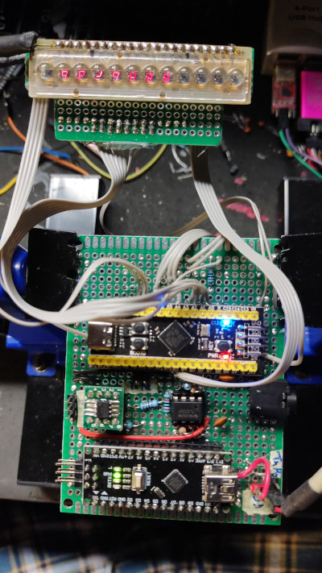
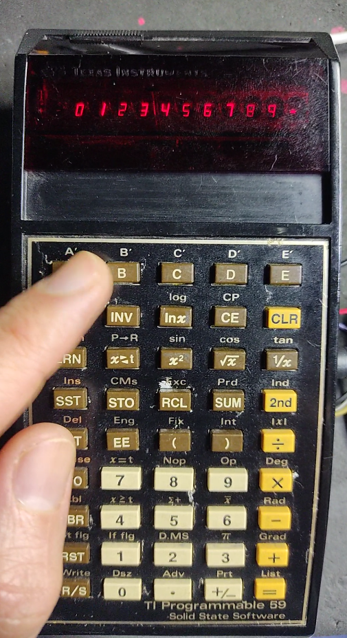
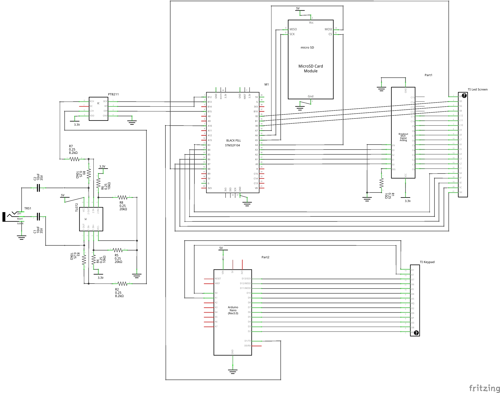

# operator-calculator
A digital synthesizer, based on arduino nano + blackpill + an old TI-59

This software is the firmware for the two main modules of this synth:

* An Arduino Nano or clone that controls the TI-59 keypad
* A stm32 blackpill, which connects to the arduino and controls the dac, an sd-card reader, and the TI-59 display

